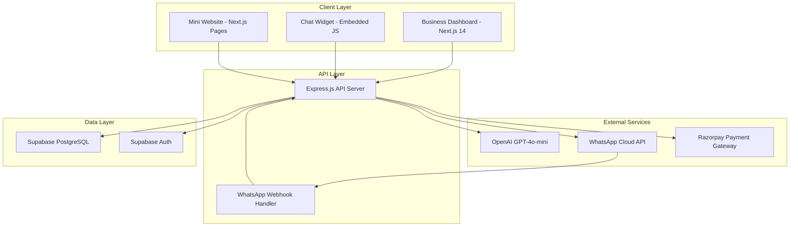

# Design Document

## Overview

AutoLead AI is a comprehensive lead capture and delivery system built with modern web technologies. The system consists of a Next.js 14 frontend with App Router, an Express.js backend API, Supabase for authentication and data storage, OpenAI for AI chat capabilities, and WhatsApp Cloud API for instant notifications.

The architecture follows a microservices approach with clear separation between the user-facing dashboard, embeddable widget system, AI chat processing, and notification delivery. The system is designed for high availability and scalability to handle multiple businesses and concurrent chat sessions.

## Architecture

### System Architecture Diagram



### Technology Stack

**Frontend:**
- Next.js 14 with App Router for the business dashboard
- Vanilla JavaScript for the embeddable chat widget
- Tailwind CSS for styling
- React Hook Form for form management

**Backend:**
- Express.js for the main API server
- Node.js runtime environment
- JWT for session management
- Webhook handlers for WhatsApp integration

**Database & Authentication:**
- Supabase PostgreSQL for data storage
- Supabase Auth for user authentication
- Row Level Security (RLS) for data protection

**External Integrations:**
- OpenAI GPT-4o-mini for AI chat responses
- WhatsApp Cloud API for message delivery
- Razorpay for payment processing

**Hosting & Deployment:**
- Vercel for frontend hosting
- Railway for backend API hosting
- Environment-based configuration

## Components and Interfaces

### 1. Authentication System

**Supabase Auth Integration:**
- Email/password authentication with Supabase Auth
- Session management using Supabase client
- Protected routes using middleware
- Password reset functionality via email

**User Management:**
```typescript
interface User {
  id: string;
  email: string;
  created_at: string;
  email_confirmed_at?: string;
}

interface AuthContext {
  user: User | null;
  signIn: (email: string, password: string) => Promise<void>;
  signUp: (email: string, password: string) => Promise<void>;
  signOut: () => Promise<void>;
  resetPassword: (email: string) => Promise<void>;
}
```

### 2. Business Configuration System

**Business Setup Form:**
- Multi-step form with validation
- Industry-specific configuration options
- WhatsApp number validation and verification
- Business profile customization

**Configuration Interface:**
```typescript
interface BusinessConfig {
  id: string;
  user_id: string;
  business_name: string;
  industry_type: 'clinic' | 'coaching' | 'real_estate' | 'local_service';
  whatsapp_number: string;
  business_description: string;
  operating_hours: {
    [key: string]: { open: string; close: string; closed: boolean };
  };
  location: string;
  contact_preferences: string[];
  widget_settings: {
    theme_color: string;
    welcome_message: string;
    position: 'bottom-right' | 'bottom-left';
  };
  created_at: string;
  updated_at: string;
}
```

### 3. Embeddable Chat Widget

**Widget Architecture:**
- Lightweight JavaScript widget (< 50KB)
- Cross-origin iframe implementation
- PostMessage API for secure communication
- Responsive design with mobile optimization

**Widget Integration:**
```javascript
// Widget embed code
<script>
  (function(w,d,s,o,f,js,fjs){
    w['AutoLeadWidget']=o;w[o]=w[o]||function(){(w[o].q=w[o].q||[]).push(arguments)};
    js=d.createElement(s),fjs=d.getElementsByTagName(s)[0];
    js.id=o;js.src=f;js.async=1;fjs.parentNode.insertBefore(js,fjs);
  }(window,document,'script','alw','https://widget.autolead.ai/widget.js'));
  alw('init', 'BUSINESS_ID');
</script>
```

**Widget Communication:**
```typescript
interface WidgetMessage {
  type: 'CHAT_MESSAGE' | 'LEAD_QUALIFIED' | 'RESIZE_WIDGET' | 'CLOSE_WIDGET';
  payload: {
    message?: string;
    lead_data?: LeadData;
    height?: number;
    business_id: string;
  };
}
```

### 4. AI Chat Processing System

**OpenAI Integration:**
- GPT-4o-mini for natural language processing
- Industry-specific prompt engineering
- Context-aware conversation management
- Lead qualification logic

**Chat Handler Interface:**
```typescript
interface ChatHandler {
  processMessage(
    message: string,
    context: ChatContext,
    businessConfig: BusinessConfig
  ): Promise<ChatResponse>;
  
  qualifyLead(
    conversation: Message[],
    businessConfig: BusinessConfig
  ): Promise<LeadQualification>;
}

interface ChatContext {
  conversation_id: string;
  business_id: string;
  visitor_id: string;
  session_data: Record<string, any>;
  message_count: number;
}

interface ChatResponse {
  message: string;
  requires_human: boolean;
  lead_qualified: boolean;
  lead_data?: LeadData;
  next_action?: 'continue' | 'escalate' | 'close';
}
```

### 5. WhatsApp Integration System

**WhatsApp Cloud API Integration:**
- Webhook handling for incoming messages
- Message sending with templates
- Interactive button responses (YES/NO)
- Message status tracking

**WhatsApp Service Interface:**
```typescript
interface WhatsAppService {
  sendLeadNotification(
    phoneNumber: string,
    leadData: LeadData,
    conversationSummary: string
  ): Promise<void>;
  
  sendMessage(
    phoneNumber: string,
    message: string,
    conversationId: string
  ): Promise<void>;
  
  handleWebhook(webhookData: WhatsAppWebhookData): Promise<void>;
}

interface LeadNotificationTemplate {
  type: 'interactive';
  interactive: {
    type: 'button';
    body: { text: string };
    action: {
      buttons: [
        { type: 'reply'; reply: { id: 'take_over'; title: 'YES' } },
        { type: 'reply'; reply: { id: 'continue_bot'; title: 'NO' } }
      ];
    };
  };
}
```

### 6. Human Takeover System

**Conversation Control:**
- Real-time conversation state management
- Message routing between AI and human
- Conversation history preservation
- Seamless handoff experience

**Takeover Interface:**
```typescript
interface ConversationControl {
  activateHumanTakeover(conversationId: string): Promise<void>;
  deactivateHumanTakeover(conversationId: string): Promise<void>;
  routeMessage(
    message: string,
    conversationId: string,
    source: 'visitor' | 'business_owner'
  ): Promise<void>;
  getConversationState(conversationId: string): Promise<ConversationState>;
}

interface ConversationState {
  id: string;
  business_id: string;
  visitor_id: string;
  status: 'active' | 'human_takeover' | 'closed';
  human_operator?: string;
  last_activity: string;
  message_count: number;
}
```

## Data Models

### Database Schema

```sql
-- Users table (managed by Supabase Auth)
-- auth.users is automatically created by Supabase

-- Business configurations
CREATE TABLE businesses (
  id UUID PRIMARY KEY DEFAULT gen_random_uuid(),
  user_id UUID REFERENCES auth.users(id) ON DELETE CASCADE,
  business_name VARCHAR(255) NOT NULL,
  industry_type VARCHAR(50) NOT NULL,
  whatsapp_number VARCHAR(20) NOT NULL,
  business_description TEXT,
  operating_hours JSONB DEFAULT '{}',
  location VARCHAR(255),
  contact_preferences TEXT[],
  widget_settings JSONB DEFAULT '{}',
  created_at TIMESTAMP WITH TIME ZONE DEFAULT NOW(),
  updated_at TIMESTAMP WITH TIME ZONE DEFAULT NOW()
);

-- Chat conversations
CREATE TABLE conversations (
  id UUID PRIMARY KEY DEFAULT gen_random_uuid(),
  business_id UUID REFERENCES businesses(id) ON DELETE CASCADE,
  visitor_id VARCHAR(255) NOT NULL,
  status VARCHAR(20) DEFAULT 'active',
  human_operator UUID REFERENCES auth.users(id),
  lead_qualified BOOLEAN DEFAULT FALSE,
  created_at TIMESTAMP WITH TIME ZONE DEFAULT NOW(),
  updated_at TIMESTAMP WITH TIME ZONE DEFAULT NOW()
);

-- Chat messages
CREATE TABLE messages (
  id UUID PRIMARY KEY DEFAULT gen_random_uuid(),
  conversation_id UUID REFERENCES conversations(id) ON DELETE CASCADE,
  sender_type VARCHAR(20) NOT NULL, -- 'visitor', 'ai', 'human'
  sender_id VARCHAR(255),
  message_text TEXT NOT NULL,
  message_type VARCHAR(20) DEFAULT 'text',
  metadata JSONB DEFAULT '{}',
  created_at TIMESTAMP WITH TIME ZONE DEFAULT NOW()
);

-- Qualified leads
CREATE TABLE leads (
  id UUID PRIMARY KEY DEFAULT gen_random_uuid(),
  business_id UUID REFERENCES businesses(id) ON DELETE CASCADE,
  conversation_id UUID REFERENCES conversations(id) ON DELETE CASCADE,
  name VARCHAR(255) NOT NULL,
  phone_number VARCHAR(20) NOT NULL,
  email VARCHAR(255),
  lead_source VARCHAR(50) DEFAULT 'chat_widget',
  qualification_data JSONB DEFAULT '{}',
  status VARCHAR(20) DEFAULT 'new',
  created_at TIMESTAMP WITH TIME ZONE DEFAULT NOW()
);

-- Subscriptions
CREATE TABLE subscriptions (
  id UUID PRIMARY KEY DEFAULT gen_random_uuid(),
  business_id UUID REFERENCES businesses(id) ON DELETE CASCADE,
  plan_type VARCHAR(20) DEFAULT 'trial',
  status VARCHAR(20) DEFAULT 'active',
  trial_expires_at TIMESTAMP WITH TIME ZONE,
  current_period_start TIMESTAMP WITH TIME ZONE,
  current_period_end TIMESTAMP WITH TIME ZONE,
  razorpay_subscription_id VARCHAR(255),
  created_at TIMESTAMP WITH TIME ZONE DEFAULT NOW(),
  updated_at TIMESTAMP WITH TIME ZONE DEFAULT NOW()
);

-- Usage tracking for trial limits
CREATE TABLE usage_tracking (
  id UUID PRIMARY KEY DEFAULT gen_random_uuid(),
  business_id UUID REFERENCES businesses(id) ON DELETE CASCADE,
  date DATE DEFAULT CURRENT_DATE,
  message_count INTEGER DEFAULT 0,
  lead_count INTEGER DEFAULT 0,
  created_at TIMESTAMP WITH TIME ZONE DEFAULT NOW(),
  updated_at TIMESTAMP WITH TIME ZONE DEFAULT NOW(),
  UNIQUE(business_id, date)
);

-- Indexes for performance
CREATE INDEX idx_conversations_business_id ON conversations(business_id);
CREATE INDEX idx_messages_conversation_id ON messages(conversation_id);
CREATE INDEX idx_leads_business_id ON leads(business_id);
CREATE INDEX idx_usage_tracking_business_date ON usage_tracking(business_id, date);
```

### TypeScript Interfaces

```typescript
interface Lead {
  id: string;
  business_id: string;
  conversation_id: string;
  name: string;
  phone_number: string;
  email?: string;
  lead_source: string;
  qualification_data: Record<string, any>;
  status: 'new' | 'contacted' | 'qualified' | 'converted';
  created_at: string;
}

interface Conversation {
  id: string;
  business_id: string;
  visitor_id: string;
  status: 'active' | 'human_takeover' | 'closed';
  human_operator?: string;
  lead_qualified: boolean;
  created_at: string;
  updated_at: string;
  messages?: Message[];
}

interface Message {
  id: string;
  conversation_id: string;
  sender_type: 'visitor' | 'ai' | 'human';
  sender_id?: string;
  message_text: string;
  message_type: 'text' | 'image' | 'file';
  metadata: Record<string, any>;
  created_at: string;
}

interface Subscription {
  id: string;
  business_id: string;
  plan_type: 'trial' | 'paid';
  status: 'active' | 'cancelled' | 'expired';
  trial_expires_at?: string;
  current_period_start?: string;
  current_period_end?: string;
  razorpay_subscription_id?: string;
  created_at: string;
  updated_at: string;
}
```

## Correctness Properties

*A property is a characteristic or behavior that should hold true across all valid executions of a system—essentially, a formal statement about what the system should do. Properties serve as the bridge between human-readable specifications and machine-verifiable correctness guarantees.*

Based on the requirements analysis, the following properties ensure the correctness of AutoLead AI across all valid inputs and scenarios:

### Property 1: Authentication System Correctness
*For any* valid email and password combination, the authentication system should create an account, authenticate the user, and redirect to the dashboard, while rejecting invalid credentials with appropriate error messages.
**Validates: Requirements 1.2, 1.3, 1.4**

### Property 2: Business Configuration Management
*For any* valid business configuration data, the system should save the configuration and generate deployment options, while rejecting invalid data (such as malformed WhatsApp numbers) with validation errors and allowing updates to existing configurations.
**Validates: Requirements 2.3, 2.4, 2.5**

### Property 3: Unique Resource Generation
*For any* completed business setup, the system should generate unique embeddable widget codes and mini-website URLs that are distinct across different businesses.
**Validates: Requirements 3.1, 4.1**

### Property 4: Widget Display Consistency
*For any* embedded widget code, the chat interface should display consistently with the business branding and include all required business information.
**Validates: Requirements 3.3, 4.2**

### Property 5: AI Conversation Management
*For any* business configuration and visitor interaction, the AI bot should engage with business-specific conversation, collect required contact information when interest is shown, adapt conversation flow based on industry type, and create qualified lead records when contact information is collected.
**Validates: Requirements 5.2, 5.3, 5.4, 5.5**

### Property 6: WhatsApp Notification System
*For any* qualified lead, the WhatsApp notification should include all required information (lead name, phone number, conversation summary, and YES/NO options), properly enable human takeover when "YES" is received, continue AI handling when "NO" is received, and handle API failures gracefully with retry mechanisms.
**Validates: Requirements 6.2, 6.3, 6.4, 6.5**

### Property 7: Human Takeover Control
*For any* conversation where human takeover is activated, the system should disable AI responses, route visitor messages to business owner's WhatsApp, deliver business owner messages to visitors through the original interface, maintain conversation history during handoff, and allow return of control to AI.
**Validates: Requirements 7.1, 7.2, 7.3, 7.4, 7.5**

### Property 8: Trial Account Management
*For any* new account, the system should assign trial status with 24-hour duration, enforce limits of 20 messages and 5 leads, disable functionality when limits are reached, and disable all features when trial expires.
**Validates: Requirements 8.1, 8.2, 8.3, 8.4, 8.5**

### Property 9: Subscription Management
*For any* trial account reaching limits, the system should display subscription options, activate unlimited features upon successful payment, handle renewals automatically, and provide notifications with retry options for payment failures.
**Validates: Requirements 9.1, 9.3, 9.4, 9.5**

### Property 10: Data Persistence and Access
*For any* business data, conversations, and leads, the system should store them securely, persist lead information with timestamps and context, maintain conversation history for at least 30 days, and provide dashboard access to business owners.
**Validates: Requirements 10.1, 10.2, 10.3**

### Property 11: System Error Recovery
*For any* system error that occurs, the system should log the error details and attempt automatic recovery procedures.
**Validates: Requirements 11.5**

## Error Handling

### Authentication Errors
- Invalid email format validation with user-friendly messages
- Password strength requirements with clear feedback
- Account lockout protection after multiple failed attempts
- Email verification error handling with resend options

### Business Configuration Errors
- WhatsApp number format validation with international support
- Required field validation with specific error messages
- Industry type validation against allowed values
- Operating hours format validation

### Chat Widget Errors
- Cross-origin communication error handling
- Widget loading failure fallbacks
- Network connectivity error recovery
- Message delivery failure handling

### AI Processing Errors
- OpenAI API failure handling with fallback responses
- Context preservation during API errors
- Conversation state recovery mechanisms
- Lead qualification error handling

### WhatsApp Integration Errors
- Webhook verification failures
- Message delivery failures with retry logic
- Rate limiting handling
- Invalid phone number handling

### Payment Processing Errors
- Razorpay integration error handling
- Payment failure notifications
- Subscription renewal failure handling
- Refund processing error management

### Database Errors
- Connection failure handling with reconnection logic
- Transaction rollback on failures
- Data consistency error recovery
- Backup and restore error handling

## Testing Strategy

### Dual Testing Approach

The AutoLead AI system requires both unit testing and property-based testing for comprehensive coverage:

**Unit Tests** focus on:
- Specific examples of authentication flows
- Edge cases in business configuration validation
- Integration points between components
- Error conditions and boundary cases
- WhatsApp webhook payload handling
- Payment processing scenarios

**Property Tests** focus on:
- Universal properties that hold for all inputs
- Comprehensive input coverage through randomization
- System behavior across all valid business configurations
- Data consistency across all operations
- Security properties across all user interactions

### Property-Based Testing Configuration

**Testing Library**: Use `fast-check` for JavaScript/TypeScript property-based testing
**Test Configuration**: Minimum 100 iterations per property test
**Test Tagging**: Each property test must reference its design document property

Tag format: **Feature: autolead-ai, Property {number}: {property_text}**

### Testing Implementation Requirements

Each correctness property must be implemented by a single property-based test that:
1. Generates random valid inputs for the property domain
2. Executes the system behavior being tested
3. Verifies the expected property holds true
4. References the specific design document property
5. Runs with at least 100 random test cases

### Integration Testing Strategy

**API Integration Tests**:
- WhatsApp Cloud API webhook handling
- OpenAI API integration and fallback behavior
- Razorpay payment processing flows
- Supabase authentication and database operations

**End-to-End Testing**:
- Complete lead capture flow from widget to WhatsApp notification
- Human takeover scenarios with message routing
- Trial limit enforcement and subscription activation
- Cross-origin widget embedding and communication

### Performance Testing Considerations

While performance requirements (2-second widget loading, 3-second AI responses, 10-second WhatsApp delivery) are specified in requirements, these are monitored through:
- Application performance monitoring (APM) tools
- Real-time alerting for performance degradation
- Load testing in staging environments
- User experience monitoring in production

Performance properties are not included in the correctness properties as they depend on external factors (network latency, API response times) that cannot be reliably tested in isolated unit tests.